 

 

### `01` &nbsp;about

I'm a Ph.D. student in Computer Science (HPC concentration) at the **University of Tennessee, Knoxville**, where I'm a graduate research assistant in the [Global Computing Lab](https://globalcomputing.group) with Dr. Michela Taufer. I build **performance analysis tools for high-performance computing**. Most of my work asks one question: *why did this code run the way it did?*

- 🔬 &nbsp;**Now:** building an LLVM pass plugin that exposes compiler optimization remarks to annotation-based profilers such as [Caliper](https://github.com/LLNL/Caliper), so runtime performance can be traced back to compiler decisions.
- 🏛️ &nbsp;**Labs:** two summers at **Lawrence Livermore National Laboratory** (2024, 2025) and one at **Los Alamos National Laboratory** (2023).
- 🎓 &nbsp;**Recognition:** UTK Graduate Fellowship · ACM Student Research Competition at SC24 and SC25 · Lead Student Volunteer at SC25.
- 🐧 &nbsp;**Off the clock:** tinkering with NixOS and Hyprland, writing toy compilers, and slowly learning Rust.

 

### `02` &nbsp;where my cycles go

A not-very-scientific flame graph of my time. Wider bars mean more time.

 

### `03` &nbsp;research & open source

| project | what it does | my role |
| :-- | :-- | :-- |
| [**Thicket**](https://github.com/LLNL/thicket) | Python toolkit for exploratory analysis of *ensembles* of HPC performance profiles | developer · researcher |
| [**Hatchet**](https://github.com/LLNL/hatchet) | Analyzes calling-context trees from many HPC profilers through one common data model | developer · researcher |
| [**RAJAPerf**](https://github.com/LLNL/RAJAPerf) | RAJA Performance Suite. I use it to study performance portability across CPUs and GPUs | researcher |
| **Compiler provenance** | Records which compiler optimizations fired and links them to runtime data in Caliper and Thicket | developer · researcher |
| [**ANACIN-X**](https://github.com/TauferLab/ANACIN-X) | Trace-based analysis of non-deterministic behavior in MPI applications | developer · researcher |

 

### `04` &nbsp;publications & posters

> **RAJA Performance Suite: Performance Portability Analysis with Caliper and Thicket** 
> O. Pearce, J. Burmark, R. Hornung, **B. Bogale**, I. Lumsden, M. McKinsey, D. Yokelson, D. Boehme, S. Brink, M. Taufer, T. Scogland 
> `P3HPC @ SC'24` · <i>Workshop on Performance, Portability & Productivity in HPC</i>

> **Towards Affordable Reproducibility Using Scalable Capture and Comparison of Intermediate Multi-Run Results** 
> N. Tan, K. Assogba, W. J. Ashworth, **B. T. Bogale**, F. Cappello, M. M. Rafique, M. Taufer, B. Nicolae 
> `Middleware '24` · <i>25th ACM/IFIP International Middleware Conference</i>

<b>posters</b>: ACM Student Research Competition

 

- **An Approach for Correlating Compiler Optimizations with Runtime Performance** · `ACM SRC @ SC'25`
- **Cluster-Based Methodology for Characterizing the Performance of Portable Applications** · `ACM SRC @ SC'24`

 

### `05` &nbsp;experience

| when | where | what |
| :-- | :-- | :-- |
| 2024&nbsp;→&nbsp;now | **UTK** · Graduate Research Assistant | LLVM pass plugin for compiler remarks; how compilers and `-O` levels shape application performance |
| summer&nbsp;2025 | **LLNL** · Defense Science & Technology Intern | Lightweight runtime provenance for compiler optimizations, integrated with Caliper and Thicket and validated on RAJAPerf |
| summer&nbsp;2024 | **LLNL** · Graduate Computing Scholar | Cluster-based method for characterizing portable application performance across CPU and GPU architectures |
| summer&nbsp;2023 | **LANL** · Parallel Computing Intern | Parallelized X-ray transport simulations with Kokkos, reaching a **>13× speedup** over serial |
| 2022&nbsp;→&nbsp;2024 | **UTK** · Undergraduate Research Assistant | Apptainer/Singularity containers for reproducibility, non-determinism in HPC, and dedup-based NN checkpointing |

 

### `06` &nbsp;toolbox

&emsp;

&emsp;

&emsp;

 

### `07` &nbsp;activity

<picture>
  <source media="(prefers-color-scheme: dark)" srcset="https://raw.githubusercontent.com/Yejashi/yejashi/output/snake-dark.svg" />
  <source media="(prefers-color-scheme: light)" srcset="https://raw.githubusercontent.com/Yejashi/yejashi/output/snake-light.svg" />
  
</picture>

befikir@gclab:~$ <code>exit</code> &nbsp;·&nbsp; thanks for stopping by

